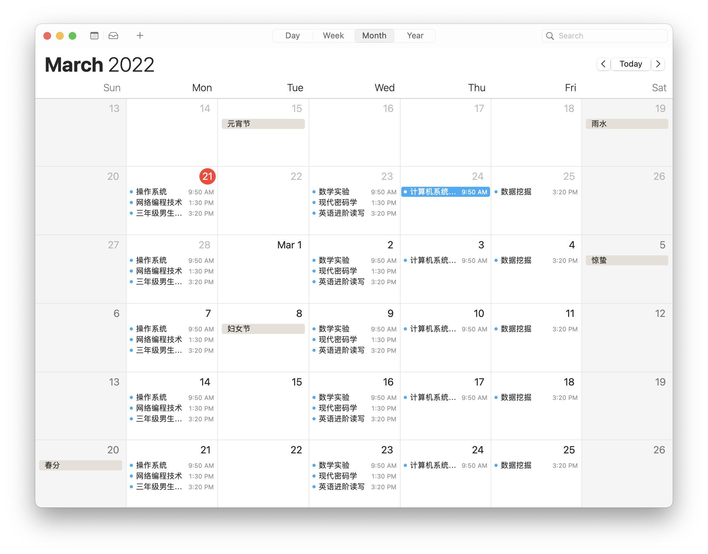

# THUCal

Sync Tsinghua course with your local calender, wich ICS file format.



## Quick Start

### Install Node.js

```sh
brew install node
```

### Download Source Code

```sh
git clone git@github.com:Cydiater/thucal.git
```

### Install Dependency

```sh
cd thucal
yarn install
```

### Run

```sh
yarn start
```

